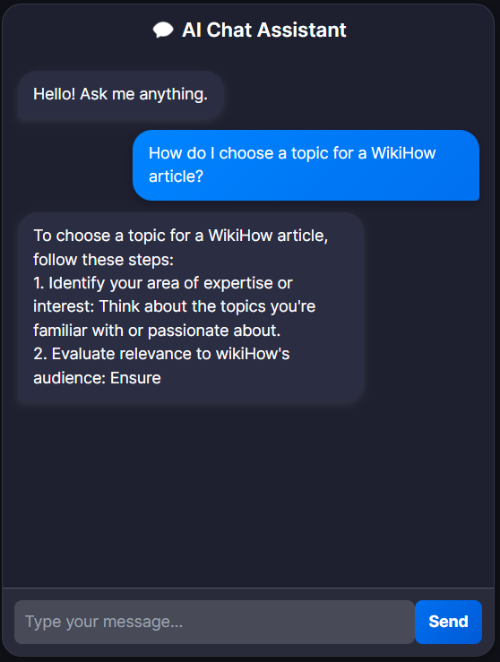

# **WikiRAG**

This project is a **Proof of Concept (PoC)** for a **Retrieval-Augmented Generation (RAG)** system using **FastAPI**, **Qdrant (vector database)**, and **Hugging Face API**.

## ** Features**
- **FastAPI Backend** for handling queries
- **Qdrant Vector Database** for efficient retrieval
- **Hugging Face API** for generating responses
- **Docker Support** for easy deployment

---

## Installation & Setup

### Clone the Repository
```
git clone git@github.com:amitsou/WikiRAG-.git
cd WikiRAG-
```

### Create a Virtual Environment
```
python -m venv venv
source venv/bin/activate   # macOS/Linux
venv\Scripts\activate      # Windows
```

### Install Dependencies
```
pip install -r requirements.txt
```

### Setting Up Qdrant
Step 1: Download the Dataset
Run the following command to download and prepare the dataset:

```
python main.py --download
```

Step 2: Ingest Data into Qdrant. Make sure that Qdrant is installed and up in Docker.

```
python main.py --ingest
```
This will set up the Qdrant vector database with processed embeddings.

### Start FastAPI Backend
```
uvicorn src.fastapi_app.app:app --host 0.0.0.0 --port 8000
```

### Querying the API
Send a POST request to the /query endpoint:

```
curl -X 'POST' \
  'http://localhost:8000/query' \
  -H 'Content-Type: application/json' \
  -d '{"query": "How do I choose a topic for a WikiHow article?"}'
```

OR use the provided UI to query the vector db as well as the LLM.


<p align="center">
  
</p>

For a detailed explanation of the system architecture and how components interact, refer to the **Software Architecture** documentation:

[View Software Architecture Details](docs/software_architecture.md)
