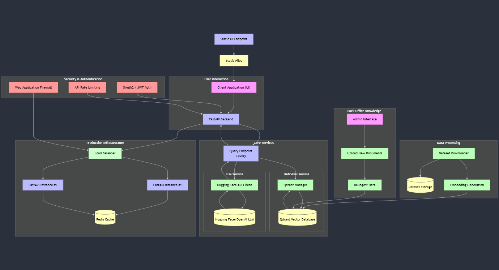

# System Architecture Diagram Explanation

Below is a detailed description of each component and how they interact based on the provided diagram.

  

---

## High-Level Overview

1. **Static UI Endpoint**
    - Hosts and serves the **static files** (HTML, CSS, JavaScript, images) for the client interface.
    - This endpoint allows users to download all necessary front-end assets to run the application interface in their browsers.

2. **User Interaction**
    - **Client Application (UI)**
      - A web-based or desktop-based front-end where users directly interact with the system.
      - Sends requests to the back-end (via FastAPI) for data retrieval, content generation, etc.
    - **FastAPI Backend**
      - A Python-based HTTP API layer (using the FastAPI framework).
      - Receives requests from the client application, coordinates authentication/authorization, and then routes valid requests to the appropriate internal services.

3. **Security & Authentication**
    - **Web Application Firewall (WAF)**
      - Protects the system from common web exploits (SQL injection, XSS, etc.).
      - Monitors and filters HTTP traffic between the outside world and the FastAPI backend.
    - **API Rate Limiting**
      - Ensures that no single client can overload the service with excessive requests.
      - Prevents denial-of-service attacks by limiting the number of requests in a given timeframe.
    - **OAuth2 / JWT Auth**
      - Facilitates secure user authentication (e.g., via JSON Web Tokens).
      - Enforces access control (which endpoints each authenticated user can access).

4. **Production Infrastructure**
    - **Load Balancer**
      - Distributes incoming traffic across multiple FastAPI instances.
      - Improves both availability and scalability.
    - **FastAPI Instance #1 & FastAPI Instance #2**
      - Multiple replicas of the FastAPI application for fault tolerance and horizontal scalability.
      - Each instance can independently process requests that come through the load balancer.
    - **Redis Cache**
      - A high-performance, in-memory data store for caching frequently accessed data.
      - Helps reduce latency and load on the back-end services.

5. **Core Services**
    - **Query Endpoint (`/query`)**
      - A dedicated API endpoint to handle user queries.
      - Orchestrates the logic between the Large Language Model (LLM) and Retrieval services.
    - **LLM Service**
      - **Hugging Face API Client / OpenAI LLM**:
         - Interfaces with external LLM APIs (e.g., Hugging Face, OpenAI) to generate or process natural language content.
         - Receives prompts from the `/query` endpoint, produces completions or results, and returns them.
    - **Retrieval Service**
      - **Qdrant Manager**:
         - A specialized component responsible for interfacing with the Qdrant database (a vector database).
         - Manages vector-based similarity searches over stored embeddings.
      - **Qdrant Vector Database**:
         - Stores vector representations (embeddings) of documents or other data.
         - Enables fast approximate nearest neighbor searches to retrieve relevant documents based on semantic similarity.

6. **Back Office Knowledge**
    - **Admin Interface**
      - A separate portal or set of views for administrators or content managers.
      - Allows privileged users to manage system data and configurations.
    - **Upload New Documents**
      - A feature or workflow enabling admins to add or update documents in the system.
      - Triggers the data ingestion pipeline.
    - **Re-Ingest Data**
      - Refreshes existing documents or triggers a re-processing pipeline (for updates in embeddings or data structure).

7. **Data Processing**
    - **Dataset Downloader**
      - Fetches or receives new data sets from external or internal sources.
      - Prepares them for embedding generation.
    - **Dataset Storage**
      - A repository (e.g., a file system or database) for storing raw and processed data.
      - Acts as the central persistence layer for documents before embedding.
    - **Embedding Generation**
      - Transforms new documents into vector embeddings (e.g., using a transformer-based model).
      - Outputs embeddings are then stored in the Qdrant Vector Database for fast retrieval.

---

## Request Flow

1. A user visits the **Client Application** (UI) served by the **Static UI Endpoint**.
2. The user logs in or makes a request. The request goes through:
    - **Web Application Firewall** -> **API Rate Limiter** -> **OAuth2/JWT Auth** checks.
3. The **Load Balancer** routes the request to one of the **FastAPI Instances**.
4. The FastAPI instance checks or fetches any necessary cached data from **Redis**.
5. The request is forwarded to the **Core Services**:
    - The **Query Endpoint** orchestrates calls to either:
      1. The **LLM Service** for language processing or generation.
      2. The **Retrieval Service** (which queries the **Qdrant Vector Database**) for relevant data.
6. Results are combined and returned back through the FastAPI layer to the **Client Application**.

---

## Data/Document Flow

1. An admin uses the **Admin Interface** to **Upload New Documents**.
2. The system triggers **Data Processing**:
    - The **Dataset Downloader** retrieves data from external or internal sources.
    - The data is saved in **Dataset Storage**.
    - **Embedding Generation** creates vector embeddings for each document.
3. The embeddings are inserted into the **Qdrant Vector Database** via the **Qdrant Manager**.
4. Once stored, user queries can retrieve these newly ingested documents through the **Retrieval Service**.
